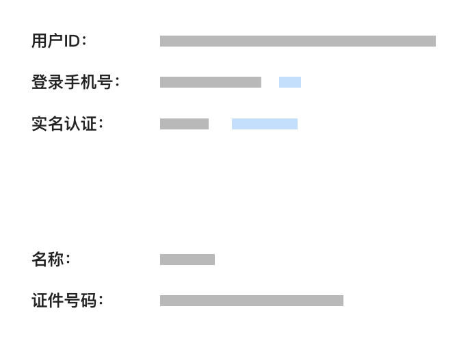
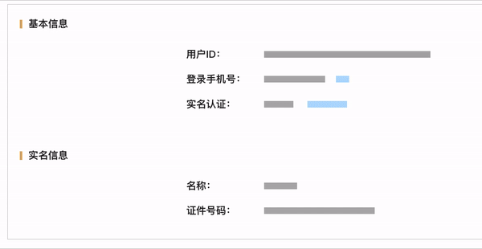

# v-sk

基于 vue2、3 的骨架屏自动生成解决方案

[demo](https://codepen.io/nanhaishiyounan/pen/NWEaXWr)





## 安装

```
npm install v-sk --save
```

```
import vsk from 'v-sk'

app.use(vsk)
```

## 示例

```
<script setup>
const title = ref('')
onMounted(() => setTimeout(() => title.value = '标题', 5000))
</script>

<template>
    <div class="title" v-sk>{{title}}</div>
    <div class="title" v-sk="['1 100']">{{title}}</div>
    <div class="title" v-sk="['2 50']">{{title}}</div>
    <div class="title" v-sk="['2 50 black']">{{title}}</div>
    <div class="title" v-sk="['1 100', '+1 50 - 120 green']">{{title}}</div>
    <div class="title" v-sk="['1 100', '+1 50 - -0 yellow']">{{title}}</div>
    <div class="title" v-sk="['1 100', '+1 50 - 50% #000000']">{{title}}</div>
    
    
</template>

<style scope>
.title {
    font-size: 30px;
    line-height: 1.2;
    color:red;
    margin-bottom: 20px;
}
.pic {
    width: 100px;
    margin: 20px;
}
.pic-2 {
    color: green;
}
</style>

```

## 说明

```
v-sk = "['lines width height positionX radio:offset color']"
```

```
v-sk.deep // 只需父元素标记，子元素自动骨架屏
```

| 字段      | 类型             | 默认值            | 缺省继承 | 说明                                                           |
| --------- | ---------------- | ----------------- | -------- | -------------------------------------------------------------- |
| lines     | number           | 1                 | 无       | 行数，+表示不换行                                              |
| width     | number(px rem %) | 100%              | -        | 宽度，默认单位 px,(最终会根据 html font-size 转换为 rem)       |
| height    | number(px rem %) | 100%              | -        | 宽度，默认单位 px,(最终会根据 html font-size 转换为 rem)       |
| positionX | number(px rem %) | 0                 | -        | 水平偏移，默认单位 px,负数表示从右边开始                       |
| radio     | number           | 60                | -        | 垂直方向上，每行色块占比，默认 60%                             |
| offset    | number           | 20                | -        | 垂直方向上，每行色块起始位置偏移，默认 20%                     |
| color     | css color        | 所在元素 color 值 | 无       | 色块颜色值，只要不是第一个位置即可,'1 100 red' or ' 1 red 100' |
